# API de Produtos - implementações

## Estrutura

A aplicação possui 5 camadas:
1. `Controller`: onde estão localizados os endpoints da aplicação e parte da documentação do Swagger;
1. `Service`: camada que chama a interação com o banco e realiza outras validações de negócio;
1. `Repository`: Interfaces de interação com o banco de dados;
1. `Model`: responsável por armazenar as entidades (modelo das tabelas do banco);
1. `Exception`: onde ficam as exceções customizadas para a API.

## Diagrama de classes (resumido)
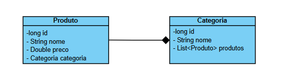

## Endpoints

### Produtos
- `GET /produtos/{id}` 
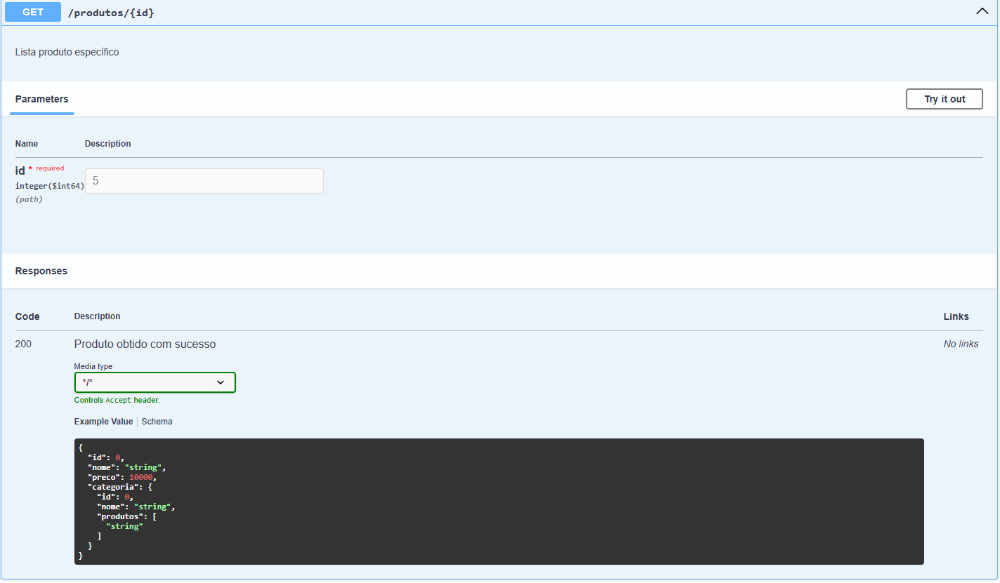

- `GET /produtos`:
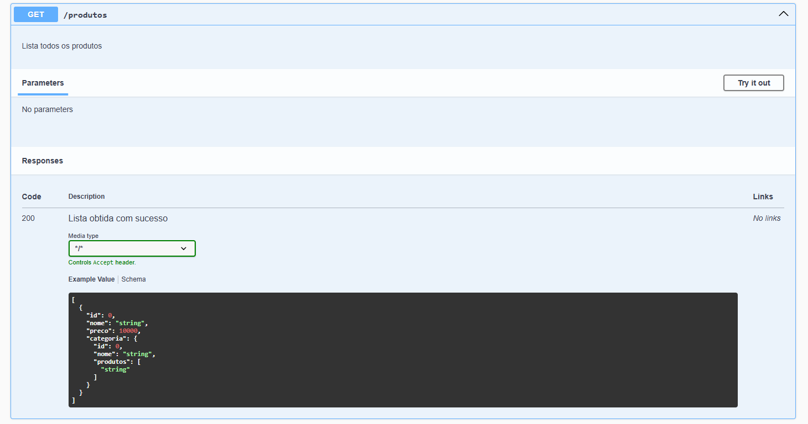

- `GET /produtos/{id}/desconto`:
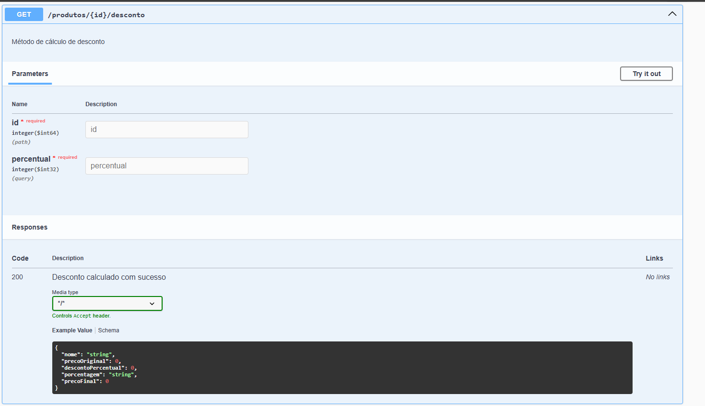

- `GET /produtos/buscar`:
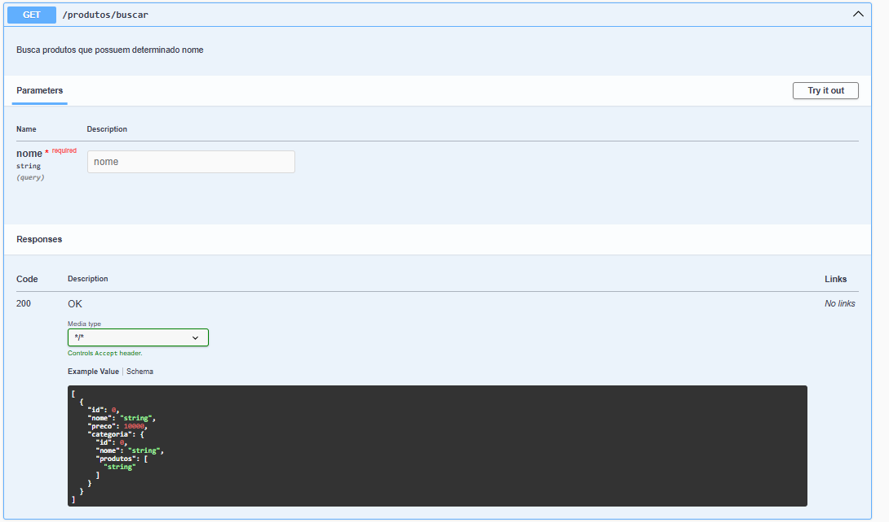

- `POST /produtos`:
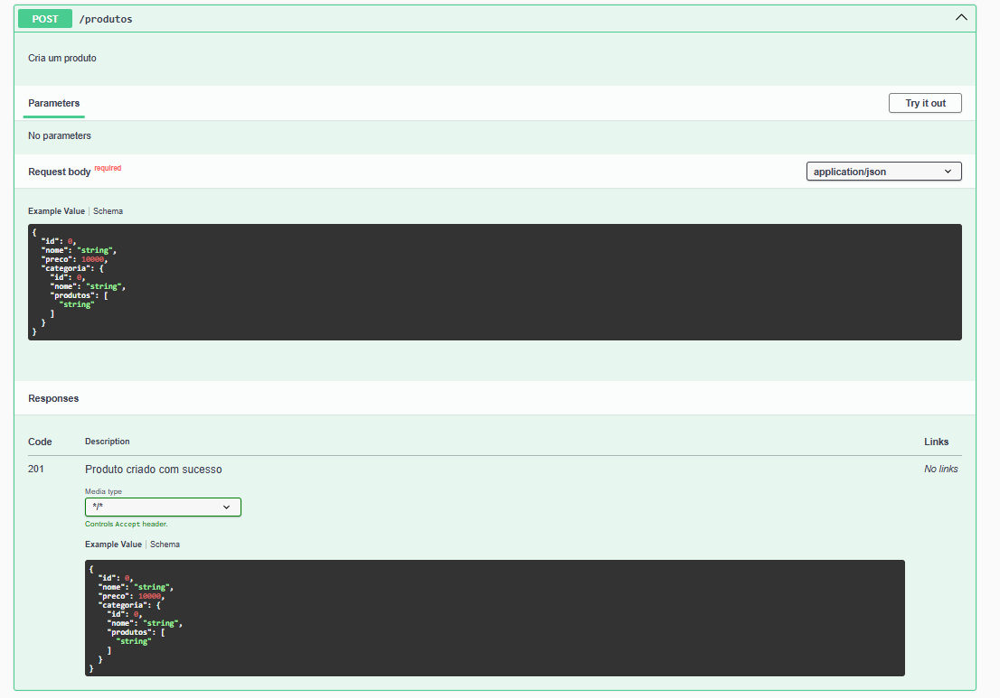
- `PUT /produtos/{id}`:
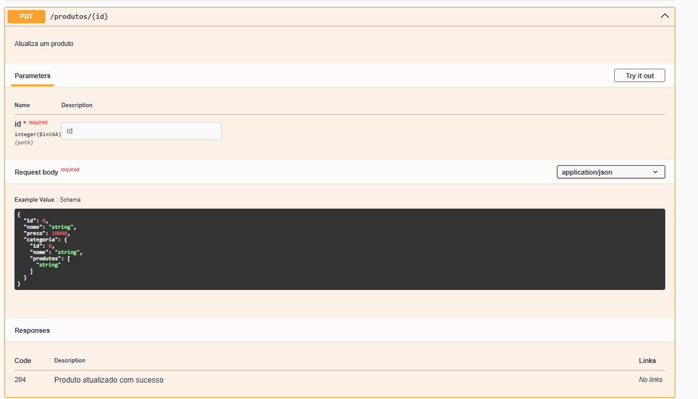
- `DELETE /produtos/{id}`:
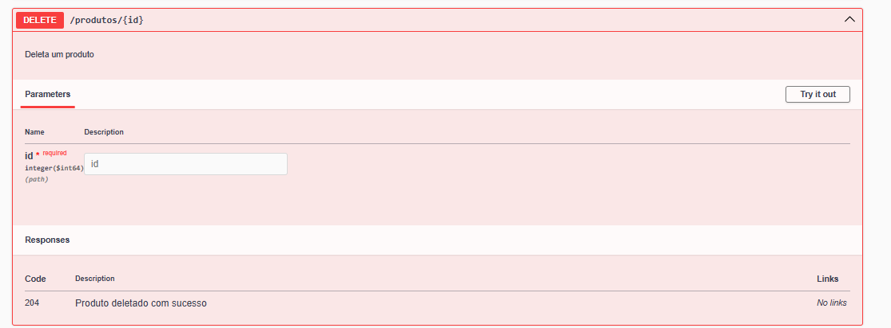

### Categorias
- `GET /categorias`:
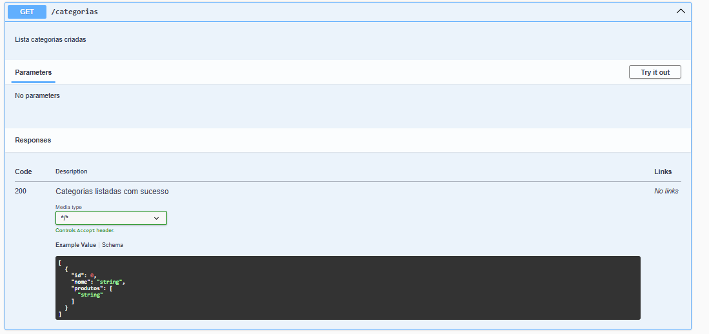
- `GET /categorias/{id}/produtos`:
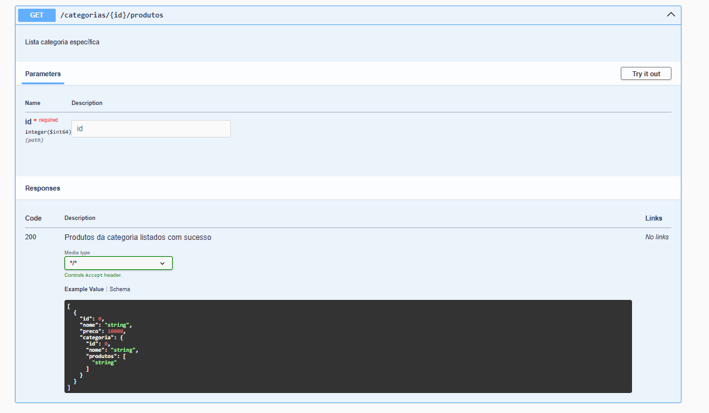
- `GET /categorias/{id}`:
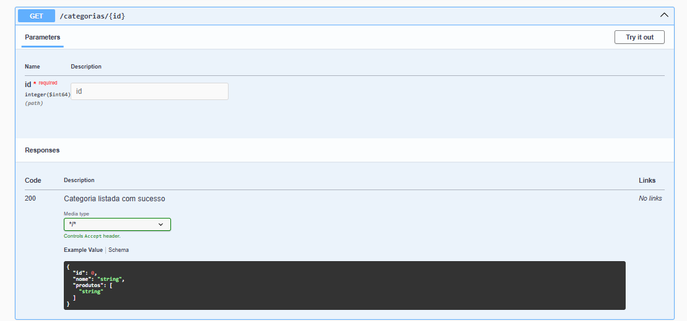
- `POST /categorias`:
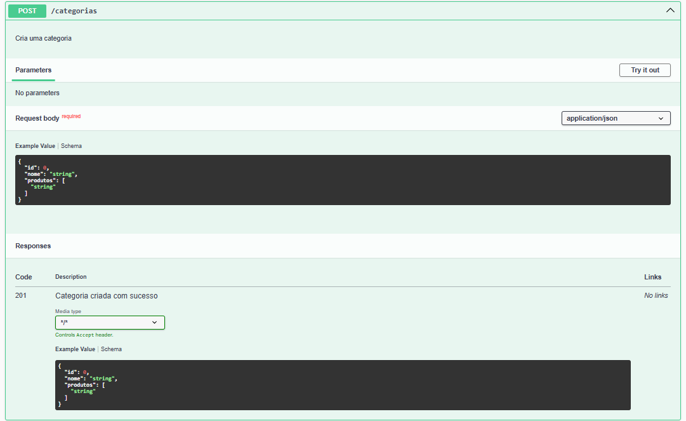
- `DELETE /categorias/{id}`:
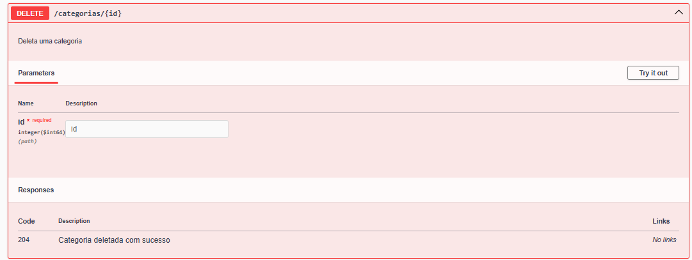

## Regras de negócio
- Não permitir descontos maiores que 50%.
- Nome não pode ser duplicado.
- Preço ≤ R$ 10.000,00.
- Não permitir atualização se o ID não existir.
- Se o nome conter “Promoção”, preço < R$ 500,00.
- A busca deve ser **contendo o texto** informado (case insensitive).
- Se nada for encontrado, retornar lista vazia (não lançar erro).
- Não permitir salvar produto sem categoria.
- A categoria deve ser escolhida por ID no momento do cadastro ou atualização do produto.

## Exemplos

### Exclusão de produto
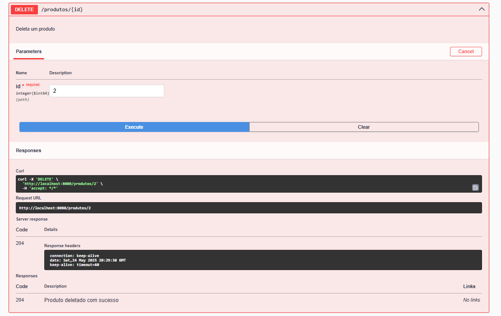

### Edição de produto
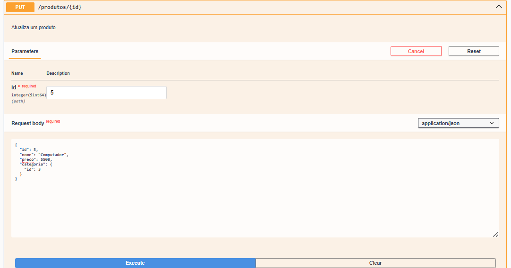
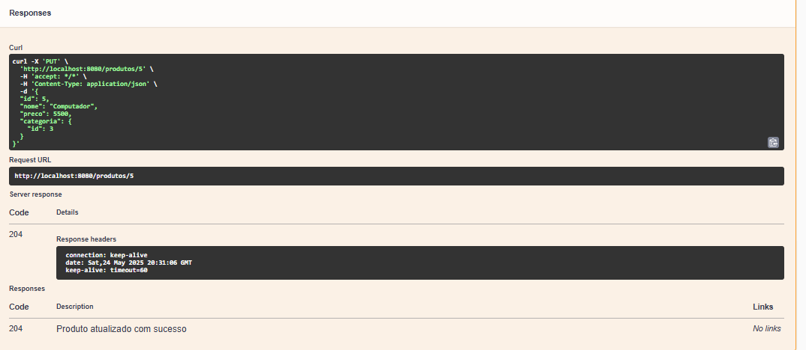
### Cálculo de desconto
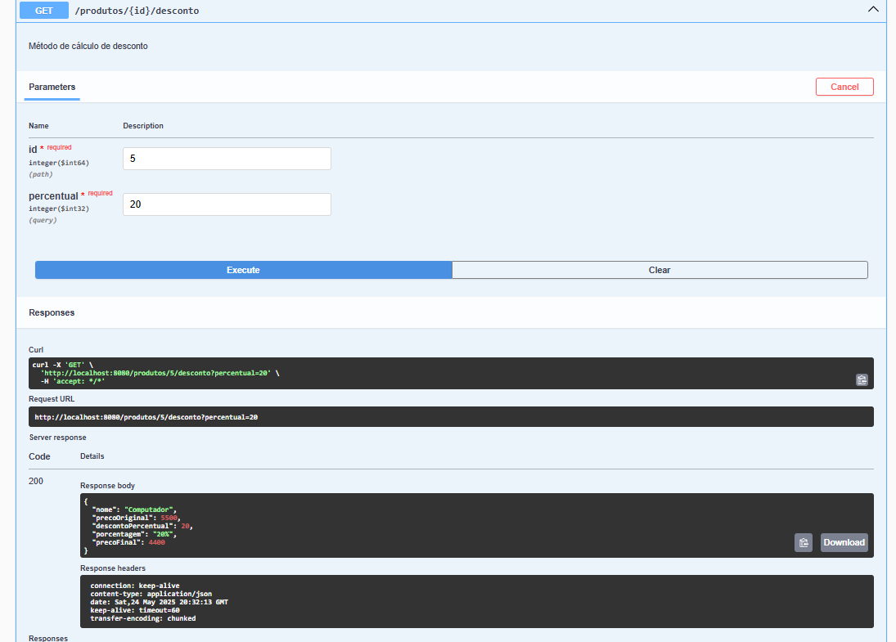

### Busca: não encontrado
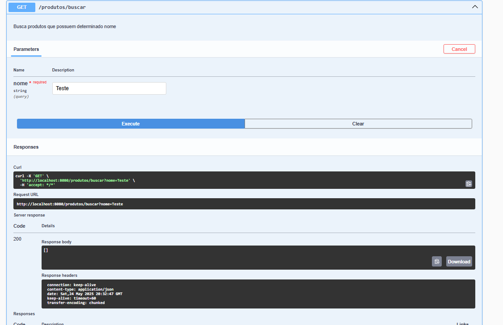

### Produtos da categoria
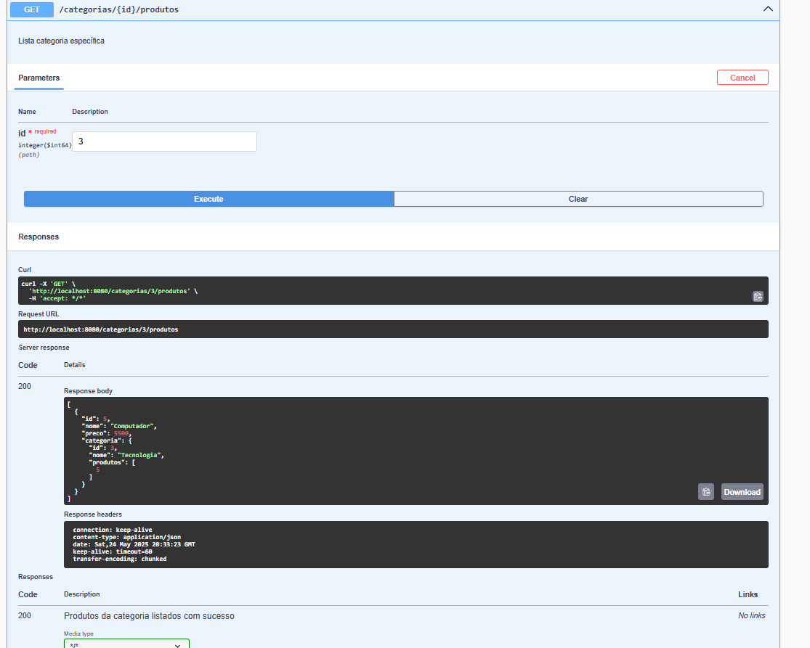

*Feito por Valentina C. Prado - PT302539X*

*Disciplina de Desenvovlvimento de API's e Microsseriços - Profº Luiz Albano*
